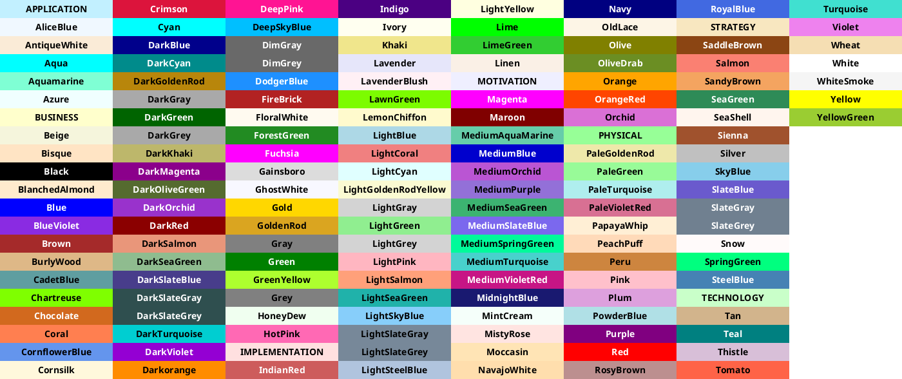
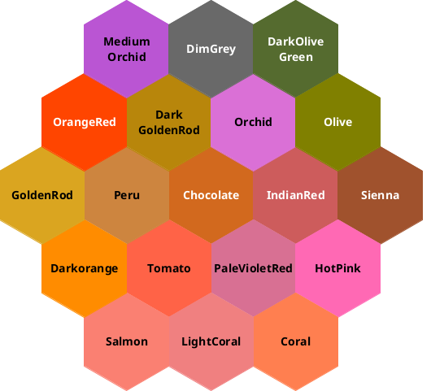

# Colors

You can use specify a color either:
  * with [its standard name](https://www.w3schools.com/colors/colors_names.asp)
  * using HEX value ''#AABBCC''
  * using short HEX value ''#ABC''

A user has recently created an image to display [all names colors used by PlantUML](https://github.com/sledgeh/PlantUML-colors). (We thank him by the way!)

So a new feature has been added to print all those colors using a special diagram description:

It is also possible to print a palette of colors close to some other color (using its name or HEX value).

