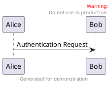
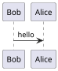
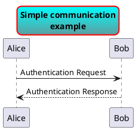
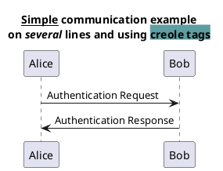
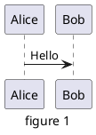
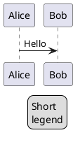

# Common commands

## Comments
Everything that starts with ''%%simple quote '%%'' is a
comment.

You can also put comments on several lines using ''%%/'%%'' to start and ''%%'/%%'' to end.

## Footer and header
You can use the commands ''header'' or ''footer'' to
add a footer or a header on any generated diagram.

You can optionally specify if you want a ''center'', ''left''
or ''right'' footer/header, by adding a keyword.

As for title, it is possible to define a header or a footer on
several lines.

It is also possible to put some HTML into the header or footer.

## Zoom

You can use the ''scale'' command to zoom the generated image.

You can use either a number or a fraction to define the scale factor.
You can also specify either width or height (in pixel).
And you can also give both width and height : the image is scaled to fit inside the specified dimension.

  * ''scale 1.5''
  * ''scale 2/3''
  * ''scale 200 width''
  * ''scale 200 height''
  * ''scale 200*100''
  * ''scale max 300*200''
  * ''scale max 1024 width''
  * ''scale max 800 height''

## Title
The ''title'' keywords is used to put a title.
You can add newline using ''\n'' in the title description.

You can use [[creole|creole formatting]] in the title.

You can also define title on several lines using ''title''
and ''end title'' keywords.

## Caption

## Legend the diagram

The ''legend'' and ''end legend'' are keywords is used to put a legend.

You can optionally specify to have ''left'', ''right'' or ''center''
alignment for the legend.

