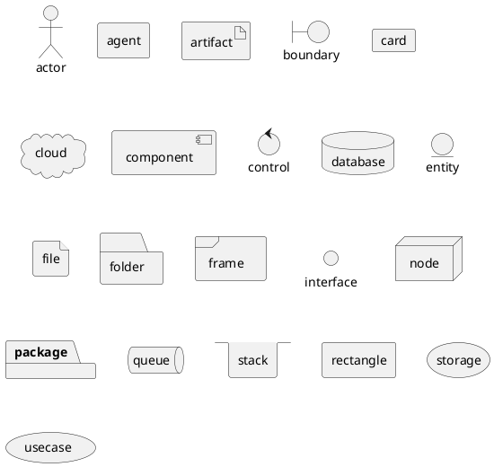
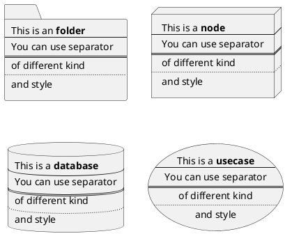
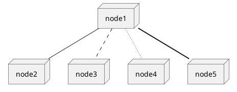
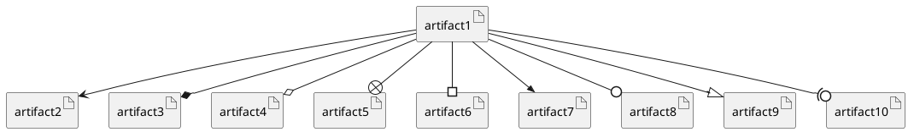
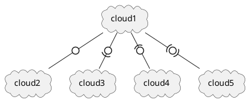
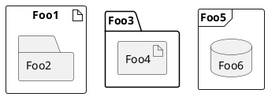
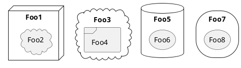
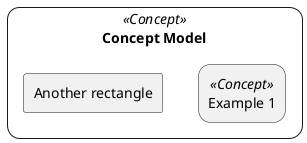

# Deployment Diagram

## Declaring element

You can optionaly put text using bracket ''[]'' for a long description.

## Linking

You can create simple links between elements:

It is possible to use several types of links:

You can also have the following types:

## Packages

## Round corner
