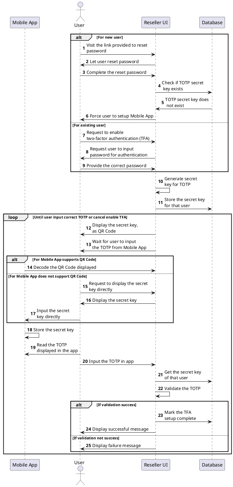
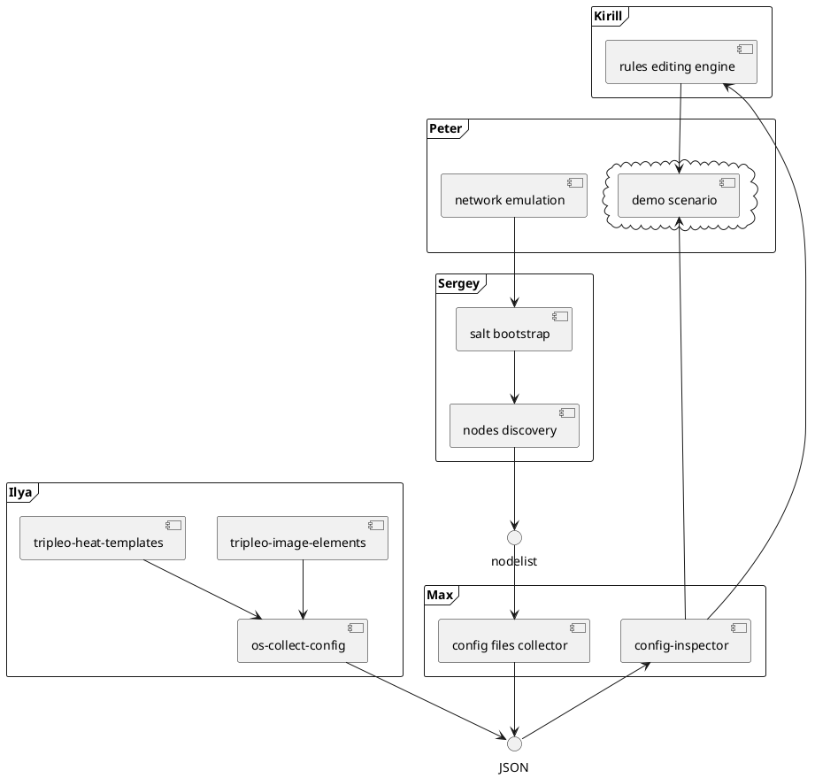

## Plantuml Real World Examples

## Sequence Diagram

```plantuml
@startuml
autonumber

participant "Mobile App" as token
actor User as user
participant "Reseller UI" as reseller_ui
participant "Database" as db

alt For new user
    user -> reseller_ui : Visit the link provided to reset \npassword
    user <- reseller_ui : Let user reset password
    user -> reseller_ui : Complete the reset password
    reseller_ui -> db : Check if TOTP secret \n key exists
    reseller_ui <- db : TOTP secret key does \n not exist
    user <- reseller_ui : Force user to setup Mobile App
else For existing user
    user -> reseller_ui : Request to enable \ntwo-factor authentication (TFA)
    user <- reseller_ui : Request user to input \npassword for authentication
    user -> reseller_ui : Provide the correct password
end
reseller_ui -> reseller_ui : Generate secret \nkey for TOTP
reseller_ui -> db : Store the secret key \nfor that user
loop Until user input correct TOTP or cancel enable TFA
    user <- reseller_ui : Display the secret key, \nas QR Code
    user <- reseller_ui : Wait for user to input \nthe TOTP from Mobile App
    alt For Mobile App supports QR Code
        token -> reseller_ui : Decode the QR Code displayed
    else For Mobile App does not support QR Code 
        user -> reseller_ui : Request to display the secret \nkey directly
        user <- reseller_ui : Display the secret key
        user -> token : Input the secret \nkey directly 
    end
    token -> token : Store the secret key
    user -> token : Read the TOTP \ndisplayed in the app 
    user -> reseller_ui : Input the TOTP in app 
    reseller_ui -> db : Get the secret key \nof that user
    reseller_ui -> reseller_ui : Validate the TOTP
    alt If validation success
        reseller_ui -> db : Mark the TFA \nsetup complete
        user <- reseller_ui : Display successful message
    else If validation not success
        user <- reseller_ui : Display failure message
    end
end

@enduml
```

## Component Diagram

```plantuml
@startuml
frame "Peter" {
          [network emulation]
                cloud {
                                [demo scenario]
                                      }
}
frame "Sergey" {
          [network emulation] --> [salt bootstrap]
                [salt bootstrap] --> [nodes discovery]
}

frame "Max" {
          [config files collector]
                [config-inspector] -up-> [demo scenario]
}
frame "Ilya" {
          [tripleo-image-elements] --> [os-collect-config]
                [tripleo-heat-templates] --> [os-collect-config]
}
frame "Kirill" {
          [rules editing engine] <-- [config-inspector]
                [rules editing engine] --> [demo scenario]
}
[nodes discovery] --> nodelist
nodelist --> [config files collector]
[config files collector] --> JSON
JSON --> [config-inspector]
[os-collect-config] --> JSON
@enduml
```