# Gantt Diagram

This is only a proposal and subject to change.

You are very welcome [[http://forum.plantuml.net|to create a new discussion]] on this future syntax. Your feedbacks, ideas and suggestions help us to find the right solution.

The Gantt is described in //natural// language, using very simple sentences (subject-verb-complement). 

## Declaring tasks

Tasks defined using square bracket. Their durations are defined using the ''last'' verb:


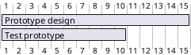

## Adding constraints
It is possible to add constraints between task. 

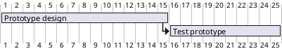

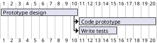

## Short names
It is possible to define short name for tasks with the ''as'' keyword. 


## Customize colors
It also possible to customize [[https://www.w3schools.com/colors/colors_names.asp|colors]]. 

```plantuml
@startgantt
[Prototype design] lasts 13 days
[Test prototype] lasts 4 days
[Test prototype] starts at [Prototype design]'s end
[Prototype design] is colored in Fuchsia/FireBrick 
[Test prototype] is colored in GreenYellow/Green 
@endgantt
```

## Milestone
You can define Milestones using the ''happens'' verb. 

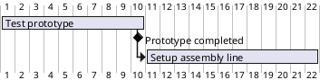

## Calendar
You can specify a starting date for the whole project. By default, the first task starts at this date. 

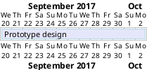

## Close day
It is possible to close some day.

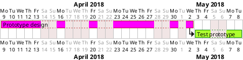

## Simplified task succession
It's possible to use the ''then'' keyword to denote consecutive tasks.

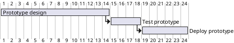

You can also use arrow ''%%->%%''

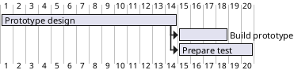

## Grouping

**Important warning** : this feature may be removed in future version, so please do not use in long term diagrams.

You can add a prefix in the form of ''prefix/'' to a task's name in order to group them together.

```plantuml
@startgantt
[Group1/Group1 Task1] lasts 5 days and is colored in Fuchsia/FireBrick
[Group2/Group2 Task1] lasts 7 days and is colored in GreenYellow/Green
[Group2/Group2 Task2] lasts 5 days and is colored in GreenYellow/Green
[Group1/Group1 Task2] lasts 7 days and is colored in Fuchsia/FireBrick
@endgantt
```

## Separator

You can use ''%%--%%'' to separate sets of tasks.

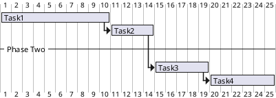

## Working with resources
You can affect tasks on resources using the ''on'' keyword and brackets for resource name.

```plantuml
@startgantt
[Task1] on {Alice} lasts 10 days
[Task2] on {Bob} lasts 2 days at 50% 
then [Task3] on {Alice} lasts 1 days at 25%
@endgantt
```

## Complex example
It also possible to use the ''and'' conjunction.

You can also add delays in constraints. 

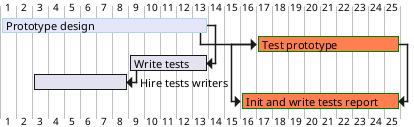
