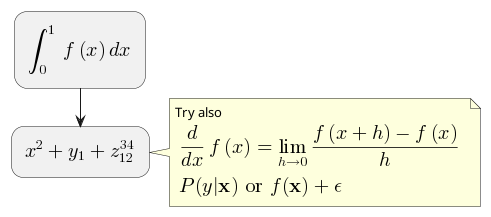
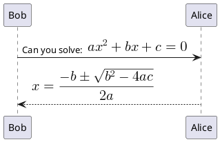
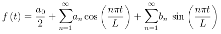
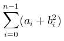

# Math

You can use [AsciiMath](http://asciimath.org) or [JLaTeXMath](https://github.com/opencollab/jlatexmath) notation within PlantUML:

or:

## Standalone diagram

You can also use ''@startmath''/''@endmath'' to create standalone [[http://asciimath.org|AsciiMath]] formula.

Or use ''@startlatex''/''@endlatex'' to create standalone [[https://github.com/opencollab/jlatexmath|JLaTeXMath]] formula. 

## How is this working?
To draw those formulas, PlantUML uses two OpenSource projects: 

  * [AsciiMath](https://github.com/asciimath/asciimathml/tree/master/asciimath-based) that converts AsciiMath notation to LaTeX expression.
  * [JLatexMath](https://github.com/opencollab/jlatexmath) that displays mathematical formulas written in LaTeX. JLaTeXMath is the best Java library to display LaTeX code.

[ASCIIMathTeXImg.js](https://github.com/asciimath/asciimathml/blob/master/asciimath-based/ASCIIMathTeXImg.js) is small enough to be integrated into PlantUML standard distribution.

Since [JLatexMath](https://github.com/opencollab/jlatexmath) is bigger, you have to [[http://beta.plantuml.net/plantuml-jlatexmath.zip|download it]] separately, then unzip the 4 jar files (//batik-all-1.7.jar//, //jlatexmath-minimal-1.0.3.jar//, //jlm_cyrillic.jar// and //jlm_greek.jar//) in the same folder as PlantUML.jar. 
