# Sequence Diagram syntax and features

PlantUML sequence diagram syntax: You can have several kinds of participants (actors and others), arrows, notes, groups... Changing fonts and colors is also possible.

## Basic examples

The sequence ''%%->%%'' is used to draw a message between two
participants.
Participants do not have to be explicitly declared.

To have a dotted arrow, you use ''%%-->%%''

It is also possible to use ''%%<-%%'' and ''%%<--%%''.
That does not change the drawing, but may improve readability.
Note that this is only true for sequence diagrams, rules are different for the other diagrams.

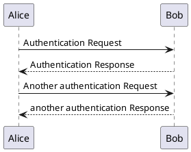

## Declaring participant 

It is possible to change participant order using the ''participant''
keyword.

It is also possible to use other keywords to declare a participant:
  * ''actor''
  * ''boundary''
  * ''control''
  * ''entity''
  * ''database''

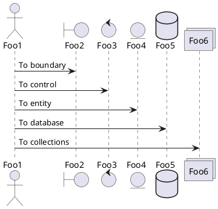

You can rename a participant using the ''as'' keyword.

You can also change the background [[color|color]] of
actor or participant.

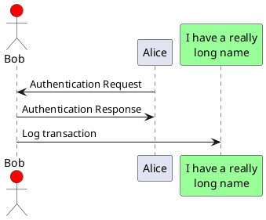

You can use the ''order'' keyword to custom the print order of participant.

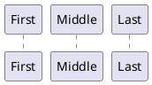

## Use non-letters in participants

You can use quotes to define participants.
And you can use the ''as'' keyword to give an alias to those participants.

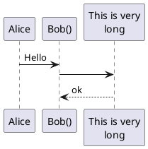

## Message to Self

A participant can send a message to itself.

It is also possible to have multi-line using ''\n''.

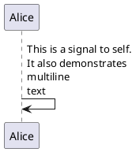

## Change arrow style

You can change arrow style by several ways:
  * add a final ''x'' to denote a lost message
  * use ''%%\%%'' or ''%%/%%'' instead of ''%%<%%'' or ''%%>%%'' to
  * have only the bottom or top part of the arrow
  * repeat the arrow head (for example, ''%%>>%%'' or ''%%//%%'') head to have a thin drawing
  * use ''%%--%%'' instead of ''%%-%%'' to have a dotted arrow
  * add a final "o" at arrow head
  * use bidirectional arrow ''%%<->%%''

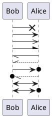

## Change arrow color

You can change the color of individual arrows using the following notation:

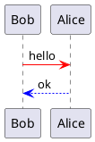

## Message sequence numbering

The keyword ''autonumber'' is used to
automatically add number to messages.

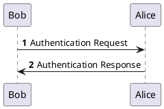

You can specify a startnumber with ''autonumber 'start''' , and
also an increment with ''autonumber 'start' 'increment'''.

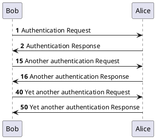

You can specify a format for your number by using between double-quote.

The formatting is done with the Java class ''DecimalFormat''
('''0''' means digit, '''#''' means digit and zero if absent).

You can use some html tag in the format.

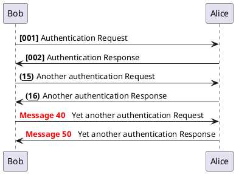

## Splitting diagrams

The ''newpage'' keyword is used to split a diagram into several images.

You can put a title for the new page just after the ''newpage''
keyword.

This is very handy with //Word// to print long diagram on
several pages.

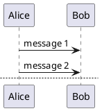

## Grouping message

It is possible to group messages together using the following
keywords:
  * 	''alt/else''
  * 	''opt''
  * 	''loop''
  * 	''par''
  * 	''break''
  * 	''critical''
  * 	''group'', followed by a text to be displayed

It is possible a add a text that will be displayed into the
header (except for ''group'').

The ''end'' keyword is used to close the group.

Note that it is possible to nest groups.

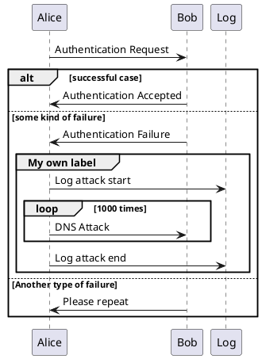

## Notes on messages

It is possible to put notes on message using the ''note left''
or ''note right'' keywords //just after the message//.

You can have a multi-line note using the ''end note''
keywords.

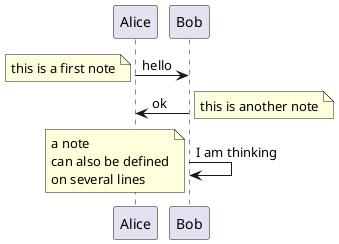

## Some other notes

It is also possible to place notes relative to participant with
''note left of'' , ''note right of'' or ''note over'' keywords.

It is possible to highlight a note by changing its background
[[color|color]].

You can also have a multi-line note using the ''end note''
keywords.

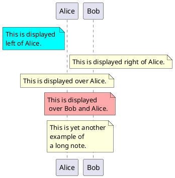

## Changing notes shape

You can use ''hnote'' and ''rnote'' keywords
to change note shapes.

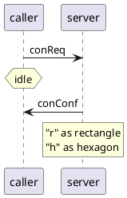

## Creole and HTML

[[creole|It is also possible to use creole formatting:]]

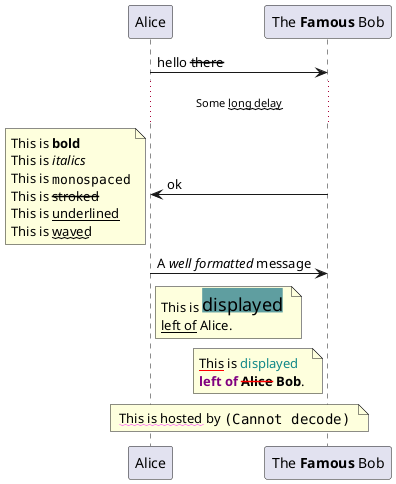

## Divider

If you want, you can split a diagram using ''=='' separator to
divide your diagram into logical steps.

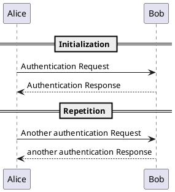

## Reference

You can use reference in a diagram, using the keyword ''ref over''.

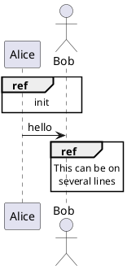

## Delay

You can use ''%%...%%'' to indicate a delay in the diagram.
And it is also possible to put a message with this delay.

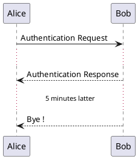

## Space

You can use ''|||'' to indicate some spacing in the diagram.

It is also possible to specify a number of pixel to be used.

```plantuml
@startuml

Alice -> Bob: message 1
Bob --> Alice: ok
|||
Alice -> Bob: message 2
Bob --> Alice: ok
||45||
Alice -> Bob: message 3
Bob --> Alice: ok

@enduml
```

## Lifeline Activation and Destruction

The ''activate'' and ''deactivate'' are used to denote
participant activation.

Once a participant is activated, its lifeline appears.

The ''activate'' and ''deactivate'' apply on
the previous message.

The ''destroy'' denote the end of the lifeline of a
participant.

```plantuml
@startuml
participant User

User -> A: DoWork
activate A

A -> B: << createRequest >>
activate B

B -> C: DoWork
activate C
C --> B: WorkDone
destroy C

B --> A: RequestCreated
deactivate B

A -> User: Done
deactivate A

@enduml
```

Nested lifeline can be used, and it is possible to add a
[[color|color]] on the
lifeline.

```plantuml
@startuml
participant User

User -> A: DoWork
activate A #FFBBBB

A -> A: Internal call
activate A #DarkSalmon

A -> B: << createRequest >>
activate B

B --> A: RequestCreated
deactivate B
deactivate A
A -> User: Done
deactivate A

@enduml
```

## Participant creation

You can use the ''create'' keyword just before the first
reception of a message to emphasize the fact that this message is
actually //creating// this new object.

```plantuml
@startuml
Bob -> Alice : hello

create Other
Alice -> Other : new

create control String
Alice -> String
note right : You can also put notes!

Alice --> Bob : ok

@enduml
```

## Incoming and outgoing messages

You can use incoming or outgoing arrows if you want to focus on a part
of the diagram.

Use square brackets to denote the left "''[''" or the
right "'']''" side of the diagram.

```plantuml
@startuml
[-> A: DoWork

activate A

A -> A: Internal call
activate A

A ->] : << createRequest >>

A<--] : RequestCreated
deactivate A
[<- A: Done
deactivate A
@enduml
```

You can also have the following syntax:

```plantuml
@startuml
[-> Bob
[o-> Bob
[o->o Bob
[x-> Bob

[<- Bob
[x<- Bob

Bob ->]
Bob ->o]
Bob o->o]
Bob ->x]

Bob <-]
Bob x<-]
@enduml
```

## Stereotypes and Spots


It is possible to add stereotypes to participants using ''%%<<%%''
and ''%%>>%%''.

In the stereotype, you can add a spotted character
in a colored circle using the syntax ''(X,color)''.

```plantuml
@startuml

participant "Famous Bob" as Bob << Generated >>
participant Alice << (C,#ADD1B2) Testable >>

Bob->Alice: First message

@enduml
```

By default, the //guillemet// character is used to display the stereotype.
You can change this behavious using the skinparam ''guillemet'':

```plantuml
@startuml

skinparam guillemet false
participant "Famous Bob" as Bob << Generated >>
participant Alice << (C,#ADD1B2) Testable >>

Bob->Alice: First message

@enduml
```

```plantuml
@startuml

participant Bob << (C,#ADD1B2) >>
participant Alice << (C,#ADD1B2) >>

Bob->Alice: First message

@enduml
```

## More information on titles

You can use [[creole|creole formatting]] in the title.

```plantuml
@startuml

title __Simple__ **communication** example

Alice -> Bob: Authentication Request
Bob -> Alice: Authentication Response

@enduml
```

You can add newline using ''\n'' in the title description.

```plantuml
@startuml

title __Simple__ communication example\non several lines

Alice -> Bob: Authentication Request
Bob -> Alice: Authentication Response

@enduml
```

You can also define title on several lines using ''title''
and ''end title'' keywords.

```plantuml
@startuml

title
 <u>Simple</u> communication example
 on <i>several</i> lines and using <font color=red>html</font>
 This is hosted by 
end title

Alice -> Bob: Authentication Request
Bob -> Alice: Authentication Response

@enduml
```

## Participants encompass

It is possible to draw a box around some participants, using ''box''
and ''end box'' commands.

You can add an optional title or a
optional background color, after the ''box'' keyword.

```plantuml
@startuml

box "Internal Service" #LightBlue
	participant Bob
	participant Alice
end box
participant Other

Bob -> Alice : hello
Alice -> Other : hello

@enduml
```

## Removing Footer

You can use the ''hide footbox'' keywords to remove the footer
of the diagram.


```plantuml
@startuml

hide footbox
title Footer removed

Alice -> Bob: Authentication Request
Bob --> Alice: Authentication Response

@enduml
```

## Skinparam

You can use the ''[[skinparam|skinparam]]''
command to change colors and fonts for the drawing.

You can use this command:
  * In the diagram definition, like any other commands,
  * In an [[preprocessing|included file]],
  * In a configuration file, provided in the [[command-line|command line]] or the [[ant-task|ANT task]].

You can also change other rendering parameter, as seen in the following examples:

```plantuml
@startuml
skinparam sequenceArrowThickness 2
skinparam roundcorner 20
skinparam maxmessagesize 60
skinparam sequenceParticipant underline

actor User
participant "First Class" as A
participant "Second Class" as B
participant "Last Class" as C

User -> A: DoWork
activate A

A -> B: Create Request
activate B

B -> C: DoWork
activate C
C --> B: WorkDone
destroy C

B --> A: Request Created
deactivate B

A --> User: Done
deactivate A

@enduml
```

```plantuml
@startuml
skinparam backgroundColor #EEEBDC
skinparam handwritten true

skinparam sequence {
	ArrowColor DeepSkyBlue
	ActorBorderColor DeepSkyBlue
	LifeLineBorderColor blue
	LifeLineBackgroundColor #A9DCDF
	
	ParticipantBorderColor DeepSkyBlue
	ParticipantBackgroundColor DodgerBlue
	ParticipantFontName Impact
	ParticipantFontSize 17
	ParticipantFontColor #A9DCDF
	
	ActorBackgroundColor aqua
	ActorFontColor DeepSkyBlue
	ActorFontSize 17
	ActorFontName Aapex
}

actor User
participant "First Class" as A
participant "Second Class" as B
participant "Last Class" as C

User -> A: DoWork
activate A

A -> B: Create Request
activate B

B -> C: DoWork
activate C
C --> B: WorkDone
destroy C

B --> A: Request Created
deactivate B

A --> User: Done
deactivate A

@enduml
```

## Changing padding

It is possible to tune some padding settings.

```plantuml
@startuml
skinparam ParticipantPadding 20
skinparam BoxPadding 10

box "Foo1"
participant Alice1
participant Alice2
end box
box "Foo2"
participant Bob1
participant Bob2
end box
Alice1 -> Bob1 : hello
Alice1 -> Out : out
@enduml
```
